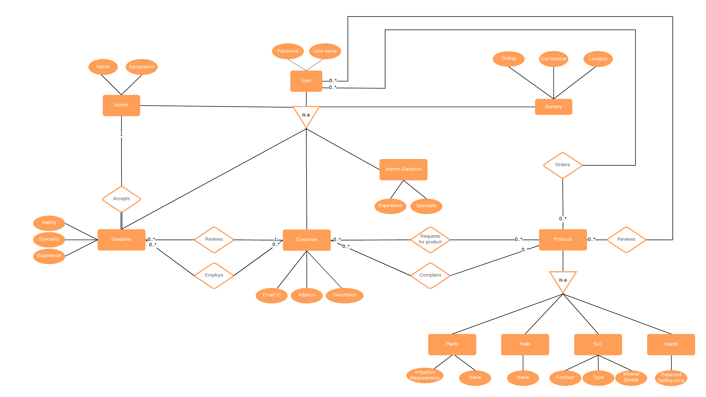

# PlantX
The website is no longer hosted on a server. Run main.py present in the project folder to locally host it.

## Abstract
PlantXchange is an application which provides gardening solutions.
It not only provides an online shopping station for plants, seeds, gardening tools and other related products, but is a descriptive online plant shop with options for pre booking, sorting by plant growth, descriptive explanation of products, price, location etc. The application seeks to include the entire community by involving nurseries, buyers, sellers, gardeners. Not looking to make landscape gardens? Not an issue! This is your place for everything plant related! 

## Repository Contents:
* Project directory contains the Flask application code.
* Backup directory contains a backup of all the files along with the code responsible for taking the backup at 12 hour interval and for embedded triggers.
* Relational Constraints.csv contains all the Foreign key, Primary key and Unique element checks;
* Integritiy Checks.csv contains all the checks put in place to ensure the data in the database is valid. (Eg: Price>0)
* DBMS.png contains the ER diagram.

## Stakeholders
* Admin
* Customer
* Gardener
* Interim Gardener
* Nursery

## Entity Recognition Diagram

  

## Technologies Used : 
* Git
* Python3 
* AWS
* Azure
* Flask
* Latex
* Bulma
* HTML
* Sklearn
* SQL
* ODBC
* Lucid Chart
